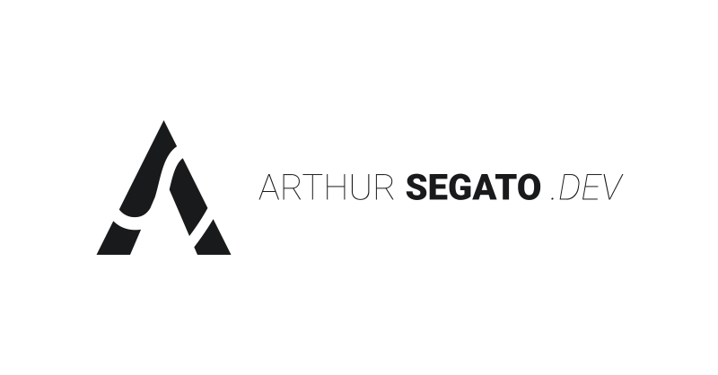

[](https://arthursegato.dev)
[](https://img.shields.io/website?url=https%3A%2F%2Farthursegato.dev)
[](https://img.shields.io/hsts/preload/arthursegato.dev)
[](https://img.shields.io/mozilla-observatory/grade/arthursegato.dev?publish)

[arthursegato.dev](https://www.arthursegato.dev/) serves as my portfolio, showcasing a extensive collection of my projects, including those that can't be uploaded to GitHub, such as videos and other multimedia content.

It's build with Vue3/Nuxt3 and deployed across the Cloudflare Pages network.

## Getting Started

These instructions will give you a copy of the project up and running on your local machine for development and testing purposes. See deployment for notes on deploying the project on a live system.

### Prerequisites

Requirements for the software and other tools to build, test and push.

- [Bun v1.1.17](https://bun.sh/) or above.

### Setup

Make sure to install the dependencies:

```bash
# npm
npm install

# pnpm
pnpm install

# yarn
yarn install

# bun
bun install
```

### Development

Start the development server on `http://localhost:3000`:

```bash
# npm
npm run dev

# pnpm
pnpm run dev

# yarn
yarn dev

# bun
bun dev
```

### Production

Build the application for production:

```bash
# npm
npm run build

# pnpm
pnpm run build

# yarn
yarn build

# bun
bun run build
```

Locally preview production build:

```bash
# npm
npm run preview

# pnpm
pnpm run preview

# yarn
yarn preview

# bun
bun run preview
```

## Deployment

This project is automatically deployed on the Cloudflare Pages network. However, if it is necessary to deploy it in another environment, adjust or completely remove, the Nitro preset configuration on `nuxt.config.ts`, based on the deployment environment you intend to use.

```Javascript
nitro: {
  /* Preset for cloudflare */
  preset: "cloudflare-pages",
},
```

Refer to the [deployment page](https://nuxt.com/docs/getting-started/deployment) in the Nuxt 3 documentation for guidance.

## Contributing

Please read [CONTRIBUTING.md](CONTRIBUTING.md) for details on our code of conduct, and the process for submitting pull requests to us.

## Authors

- **Arthur Segato** - Developed the website - [ArthurSegato](https://github.com/ArthurSegato)

See also the list of [contributors](https://github.com/ArthurSegato/TheEndPoem/graphs/contributors) who participated in this project.

## License

This project is licensed under the [MIT](LICENSE) License - see the [LICENSE.md](LICENSE) file for details.

## Acknowledgments

### External Assets

Below is a list of all the external assets used in the development of this website with their respective licenses.

- [Material Line Icons](https://github.com/cyberalien/line-md) ([MIT](https://github.com/cyberalien/line-md/blob/master/license.txt))
