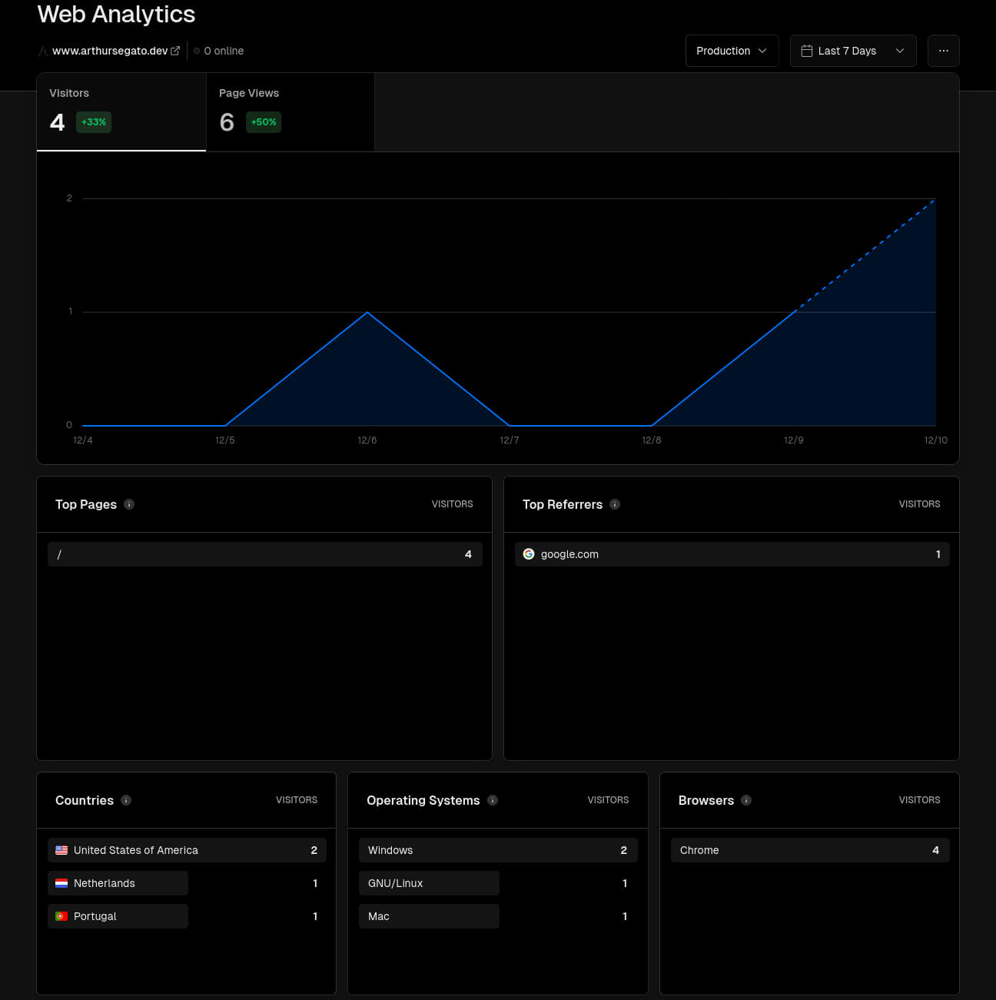
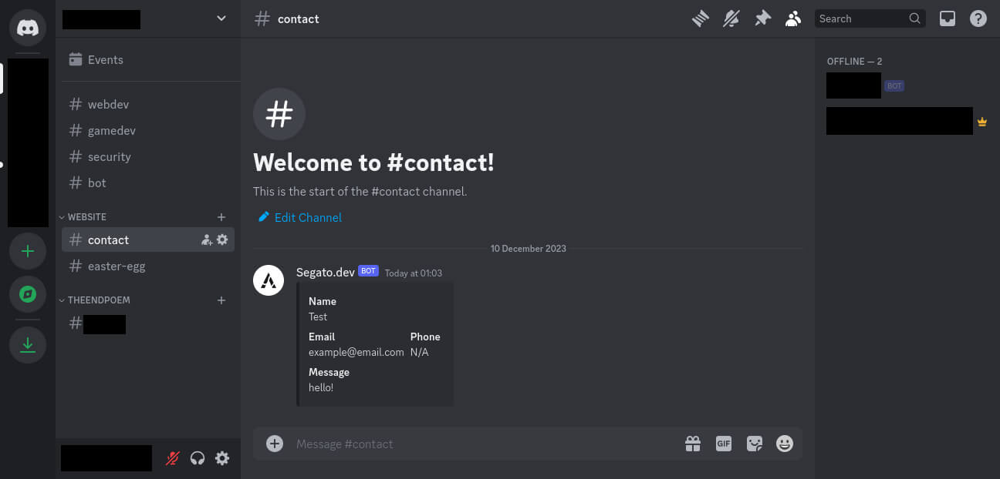

[](https://arthursegato.dev)
[](https://img.shields.io/website?url=https%3A%2F%2Farthursegato.dev)
[](https://img.shields.io/hsts/preload/arthursegato.dev)
[](https://img.shields.io/mozilla-observatory/grade/arthursegato.dev?publish)

[arthursegato.dev](https://www.arthursegato.dev/) serves as my portfolio, showcasing a extensive collection of my projects, including those that can't be uploaded to GitHub, such as videos and other multimedia content.

It's build with Vue3/Nuxt3 and deployed across the Vercel Edge network.

## Data protection legislations (GDPR, LGPD and others)

By acessing arthursegato.dev, there are two distinct occasions where user data is collected. In the first instance, technical data is gathered anonymously (as shown below) by [Vercel Web Analytics](https://vercel.com/docs/analytics) via a JS script, which can be easily blocked by any ad-blocking extension.



The second instance happens when the user inputs any data into the contact form and submit it. In this case, the content entered into the form is directly sent to a text channel on my personal Discord server, **accessible only by me** (as illustrated below), via a webhook.



**If the user wishes to delete their data, they can simply reach out to me through any available channel on my GitHub profile, [personal website](https://www.arthursegato.dev/) _(The data removal request will also be deleted)_, or via email at github.reentry594@passinbox.com**

## Requirements

- Bun v1.0.25 and above **OR** Node v21.6.0 and above

## Environment variables

.env variables for this project:

```Properties
WEBHOOK_DISCORD=""
```

## Setup

Make sure to install the dependencies:

```bash
# npm
npm install

# pnpm
pnpm install

# yarn
yarn install

# bun
bun install
```

## Development

Start the development server on `http://localhost:3000`:

```bash
# npm
npm run dev

# pnpm
pnpm run dev

# yarn
yarn dev

# bun
bun dev
```

## Production

Build the application for production:

```bash
# npm
npm run build

# pnpm
pnpm run build

# yarn
yarn build

# bun
bun run build
```

Locally preview production build:

```bash
# npm
npm run preview

# pnpm
pnpm run preview

# yarn
yarn preview

# bun
bun run preview
```

## Disclaimer

Below is a list of all the external assets used in the development of this website with their respective licenses.

- [Bootstrap Icons](https://icons.getbootstrap.com/) ([MIT](https://github.com/twbs/icons/blob/main/LICENSE))
- [Hero Icons](https://heroicons.com/) ([MIT](https://github.com/tailwindlabs/heroicons/blob/master/LICENSE))
- [daisyUI](https://daisyui.com/) ([MIT](https://github.com/saadeghi/daisyui/blob/master/LICENSE))

## Contributors

- [@ArthurSegato](https://github.com/ArthurSegato)
